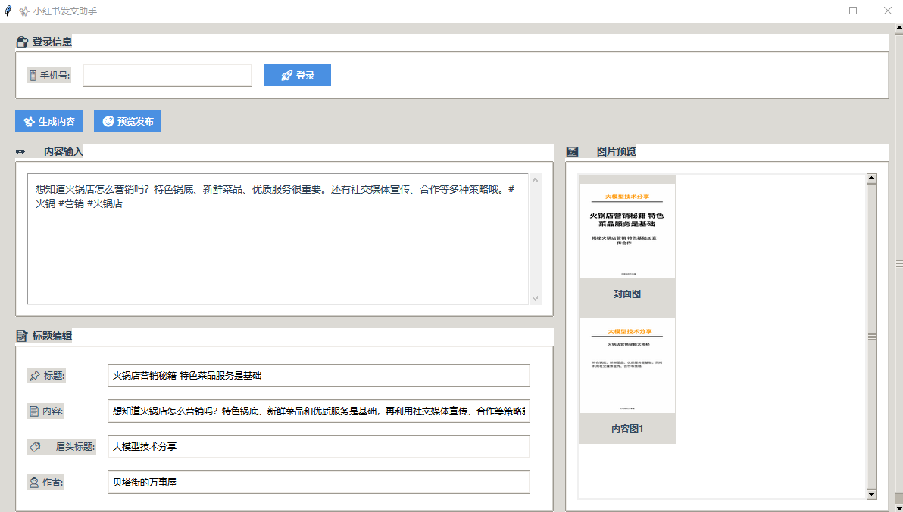
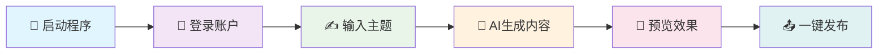

<div align="center">

<h1>🌟 小红书AI发布助手</h1>

   

<br/>

  

<br/><br/>

### 🎨 智能内容创作 • 🤖 AI驱动 • 📱 一键发布

[🇨🇳 简体中文](./readme.md) | [🇺🇸 English](./readme_en.md)

<br/>



</div>

---

## 📖 项目简介

> **小红书AI发布助手** 是一个功能强大的自动化内容创作与发布工具，专为小红书平台的内容创作者设计。

🎯 **核心价值**
- 🧠 **智能创作**: 基于先进AI技术自动生成高质量内容
- ⚡ **效率提升**: 一键操作节省90%发布时间
- 🎨 **专业品质**: 精美界面设计，用户体验极佳
- 🔧 **功能完整**: 从内容生成到发布全流程自动化

---

## ✨ 核心功能

<table>
<tr>
<td width="50%">

### 🤖 AI智能生成
- 🎯 **智能标题**: AI生成吸引人的标题
- 📝 **内容创作**: 基于主题自动生成文章
- 🖼️ **图片处理**: 智能匹配和处理图片
- 🏷️ **标签推荐**: 自动推荐热门标签

</td>
<td width="50%">

### 🚀 自动化发布
- 📱 **一键登录**: 支持手机号快速登录
- 📋 **内容预览**: 发布前完整预览效果
- ⏰ **定时发布**: 支持定时任务发布
- 💾 **状态保存**: 自动保存登录状态

</td>
</tr>
<tr>
<td width="50%">

### 👥 用户管理
- 🔄 **多账户**: 支持多个小红书账户管理
- 🌐 **代理配置**: 支持代理服务器配置
- 🔍 **浏览器指纹**: 防检测浏览器指纹
- 📊 **数据统计**: 发布数据统计分析

</td>
<td width="50%">

### 🛡️ 安全稳定
- 🔐 **数据加密**: 本地数据安全加密存储
- 🛡️ **反检测**: 先进的反检测技术
- 📝 **日志记录**: 完整的操作日志记录
- 🔄 **错误恢复**: 智能错误处理和恢复

</td>
</tr>
</table>

---

## 📁 项目架构

```
📦 xhs_ai_publisher/
├── 📂 src/                          # 🔧 源代码目录
│   ├── 📂 core/                     # ⚡ 核心功能模块
│   │   ├── 📂 models/               # 🗄️ 数据模型
│   │   ├── 📂 services/             # 🔧 业务服务层
│   │   ├── 📂 pages/                # 🎨 界面页面
│   │   ├── 📂 browser/              # 🌐 浏览器自动化
│   │   └── 📂 utils/                # 🛠️ 工具函数
│   ├── 📂 web/                      # 🌐 Web接口
│   │   ├── 📂 templates/            # 📄 HTML模板
│   │   └── 📂 static/               # 🎨 静态资源
│   └── 📂 logger/                   # 📝 日志系统
├── 📂 ai_publish_google_shop/       # 🏪 Chrome扩展
├── 📂 test/                         # 🧪 测试目录
├── 📂 build/                        # 📦 构建输出
├── 🐍 main.py                       # 🚀 主程序入口
├── 📋 requirements.txt              # 📦 依赖包列表
└── 📖 README.md                     # 📚 项目说明
```

---

## 🛠️ 快速开始

### 📋 系统要求

<div align="center">

| 组件 | 版本要求 | 说明 |
|:---:|:---:|:---:|
| 🐍 **Python** | `3.8+` | 推荐使用最新版本 |
| 🌐 **Chrome** | `最新版` | 用于浏览器自动化 |
| 💾 **内存** | `4GB+` | 推荐8GB以上 |
| 💿 **磁盘** | `2GB+` | 用于存储依赖和数据 |

</div>

### 🚀 安装方式

#### 🎯 一键安装（推荐）

根据您的操作系统选择对应的安装脚本：

<div align="center">

| 操作系统 | 安装脚本 | 启动脚本 |
|:---:|:---:|:---:|
| 🍎 **macOS** | `./install_mac.sh` | `./start_mac.sh` |
| 🐧 **Linux** | `./install_linux.sh` | `./start_linux.sh` |
| 💻 **Windows** | `install_windows.bat` | `start_windows.bat` |

</div>

<details>
<summary>🍎 <strong>macOS 安装</strong></summary>

```bash
# 1️⃣ 克隆项目
git clone https://github.com/BetaStreetOmnis/xhs_ai_publisher.git
cd xhs_ai_publisher

# 2️⃣ 运行安装脚本
./install_mac.sh

# 3️⃣ 启动程序
./start_mac.sh
```

**特性：**
- ✅ 自动检测和安装Python环境
- ✅ 自动安装Homebrew（如需要）
- ✅ 支持Apple Silicon和Intel芯片
- ✅ 完整的依赖管理和虚拟环境配置

</details>

<details>
<summary>🐧 <strong>Linux 安装</strong></summary>

```bash
# 1️⃣ 克隆项目
git clone https://github.com/BetaStreetOmnis/xhs_ai_publisher.git
cd xhs_ai_publisher

# 2️⃣ 运行安装脚本
./install_linux.sh

# 3️⃣ 启动程序
./start_linux.sh
```

**支持的发行版：**
- ✅ Ubuntu/Debian 系列
- ✅ RHEL/CentOS/Rocky Linux
- ✅ Fedora
- ✅ openSUSE/SLES
- ✅ Arch Linux/Manjaro

</details>

<details>
<summary>💻 <strong>Windows 安装</strong></summary>

```cmd
# 1️⃣ 克隆项目
git clone https://github.com/BetaStreetOmnis/xhs_ai_publisher.git
cd xhs_ai_publisher

# 2️⃣ 运行安装脚本
install_windows.bat

# 3️⃣ 启动程序
start_windows.bat
```

**系统要求：**
- ✅ Windows 10/11
- ✅ 自动安装Python（如需要）
- ✅ 完整的依赖管理

</details>

<details>
<summary>📥 <strong>手动安装（高级用户）</strong></summary>

```bash
# 1️⃣ 克隆项目
git clone https://github.com/BetaStreetOmnis/xhs_ai_publisher.git
cd xhs_ai_publisher

# 2️⃣ 创建虚拟环境
python -m venv venv

# 3️⃣ 激活虚拟环境
# Linux/Mac:
source venv/bin/activate
# Windows:
venv\Scripts\activate

# 4️⃣ 安装依赖
pip install -r requirements.txt

# 5️⃣ 初始化数据库（可选）
python init_db.py

# 6️⃣ 启动程序
python main.py
```

</details>

---

## 📱 使用指南

### 🎯 基础使用流程

<div align="center">



</div>

### 📝 详细步骤

1. **🚀 启动程序**
   - 运行 `python main.py` 或双击可执行文件
   - 等待程序加载完成

2. **👤 用户管理**
   - 点击"用户管理"按钮
   - 添加新用户或切换现有用户
   - 配置代理和浏览器指纹（可选）

3. **📱 账户登录**
   - 输入手机号码
   - 接收并输入验证码
   - 系统自动保存登录状态

4. **✍️ 内容创作**
   - 在主题输入框输入创作主题
   - 点击"生成内容"按钮
   - AI自动生成标题和内容

5. **🖼️ 图片处理**
   - 系统自动匹配相关图片
   - 可手动上传自定义图片
   - 支持多图片批量处理

6. **👀 预览发布**
   - 点击"预览发布"查看效果
   - 确认内容无误后点击发布
   - 支持定时发布功能


## 🔧 高级配置

### ⚙️ 配置文件

<details>
<summary>📁 <strong>config.py - 主配置文件</strong></summary>

```python
# AI配置
AI_CONFIG = {
    "model": "gpt-3.5-turbo",
    "max_tokens": 2000,
    "temperature": 0.7
}

# 浏览器配置
BROWSER_CONFIG = {
    "headless": False,
    "user_agent": "Mozilla/5.0...",
    "viewport": {"width": 1920, "height": 1080}
}

# 发布配置
PUBLISH_CONFIG = {
    "auto_publish": False,
    "delay_range": [3, 8],
    "max_retry": 3
}
```

</details>

### 🌐 代理配置

支持多种代理类型:
- 🔗 **HTTP代理**
- 🔒 **HTTPS代理** 
- 🧅 **SOCKS5代理**
- 🏠 **本地代理**

---

## 📊 开发路线图

<div align="center">

### 🗓️ 开发计划

</div>

- [x] ✅ **基础功能**: 内容生成和发布
- [x] ✅ **用户管理**: 多账户支持
- [x] ✅ **代理配置**: 网络代理支持
- [ ] 🔄 **内容库**: 素材管理系统
- [ ] 🔄 **模板库**: 预设模板系统
- [ ] 🔄 **数据分析**: 发布效果分析
- [ ] 🔄 **API接口**: 开放API接口
- [ ] 🔄 **移动端**: 手机端支持

---

## 🤝 参与贡献

<div align="center">

**🎉 我们欢迎所有形式的贡献!**


</div>

### 🛠️ 贡献指南

1. 🍴 Fork 项目
2. 🌿 创建功能分支 (`git checkout -b feature/AmazingFeature`)
3. 💾 提交更改 (`git commit -m 'Add some AmazingFeature'`)
4. 📤 推送到分支 (`git push origin feature/AmazingFeature`)
5. 🔄 创建 Pull Request

---

## 📞 联系我们

<div align="center">

### 💬 加入我们的社区

<table>
<tr>
<td align="center">

<br/>
<strong>🐱 微信群</strong>
<br/>
<em>扫码加入讨论</em>
</td>
<td align="center">

<br/>
<strong>📱 公众号</strong>
<br/>
<em>获取最新动态</em>
</td>
</tr>
</table>

<br/>


</div>

---

## 📄 许可证

<div align="center">

本项目采用 **Apache 2.0** 许可证 - 查看 [LICENSE](LICENSE) 文件了解详情

<br/>


<br/><br/>

---

<sub>🌟 为小红书内容创作者精心打造 | Built with ❤️ for Xiaohongshu content creators</sub>

<br/>

**⭐ 如果这个项目对您有帮助，请给我们一个星标!**

</div>